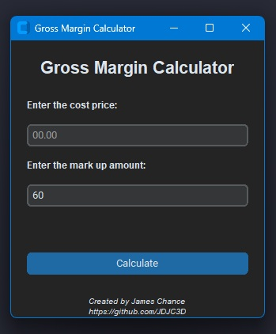

# Mark Up Calculator

## Project Description & Instructions

This is a simple app for to calculate the gross margin of a product. To use you simple enter the cost price of the product and then add your design gross margin. Once they have been completed you can either hit the enter or click the calculate button. It's as simple as that.

## Why Create This?

I have created this app for a number of reasons. I am currently going through the [100 Days of Code: The Complete Python Pro Bootcamp](https://www.udemy.com/course/100-days-of-code/?couponCode=ST2MT110724ANEW) and have reached the tkinter section of it. To improve of what I have learned I decided to create and app that I can use for work. I decided to try out [CustomTkinter](https://customtkinter.tomschimansky.com/) by Tom Schimansky as I wasn't keen on the default theming in windows. Once the app was completed I decided to try creating a exe so I don't have to have Python installed on my machine at work.

[link name](https://www.example.com)

## How to Run The Project

Clone this repository or download the zip file. Fire up vscode and pip install CustomTkinter and then run. I have created an exe file for this but will not be uploading it to this repo.

## Credits / References

- [CustomTkinter](https://customtkinter.tomschimansky.com/)
- [Auto PY to EXE](https://github.com/brentvollebregt/auto-py-to-exe)
- [Icon for File](https://www.flaticon.com/free-icons/calculator)
- [How to Write a Good README File for Your GitHub Project](https://www.freecodecamp.org/news/how-to-write-a-good-readme-file/)

## Things to Work On

So I have learnt a lot during this project. In order to get the enter button to work I had to create another function that ran the calculate function. I'm sure there is a more elegant way of doing this but I didn't want to commit that much time to it.

Although I have been using Pycharm for the course I will be switching to VS Code going forward as I have more control over how the pip packages are installed. Maybe I am missing something but VSC just seems to work better for me.

~~Next time I will look at adding screenshots and gif into the readme to make it more visually appealing.~~
